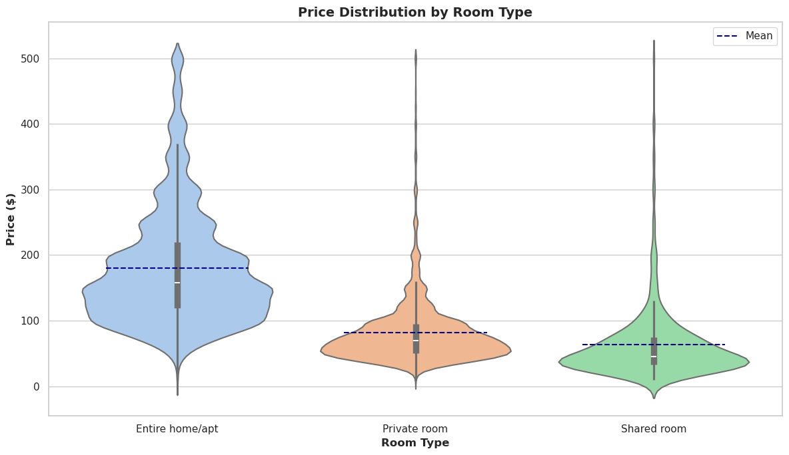
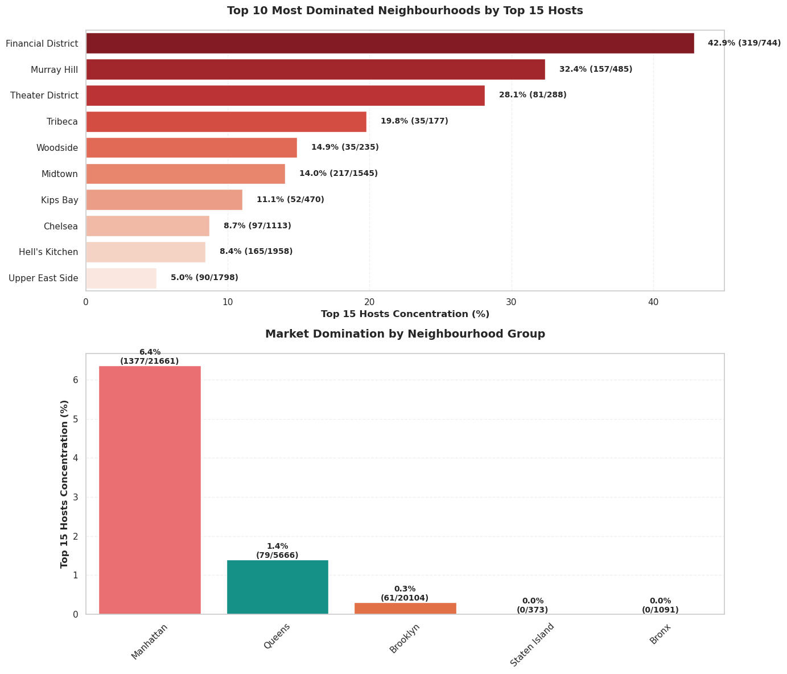
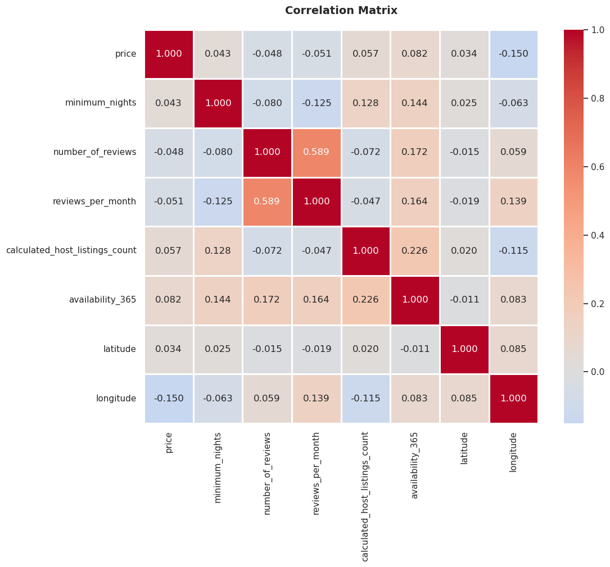
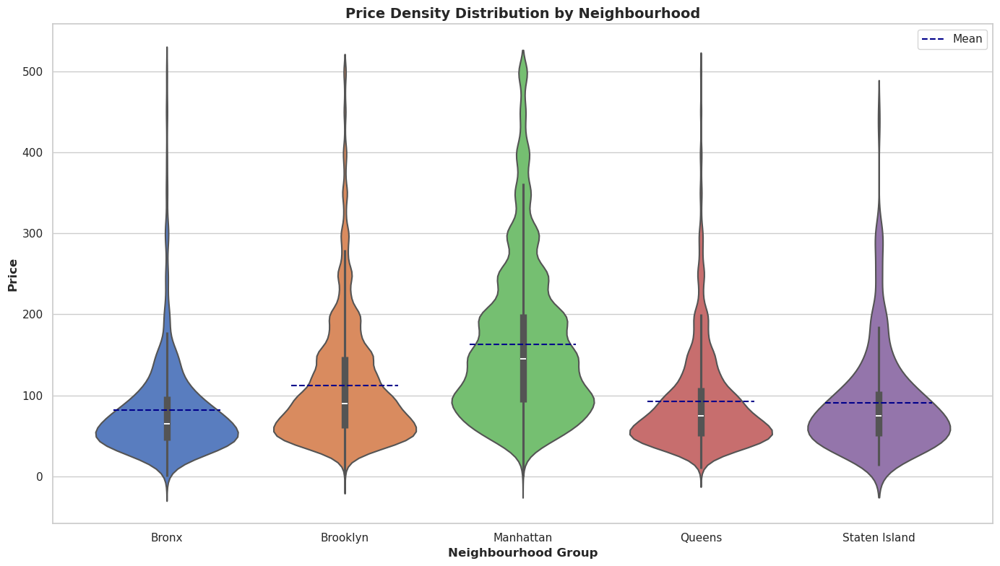
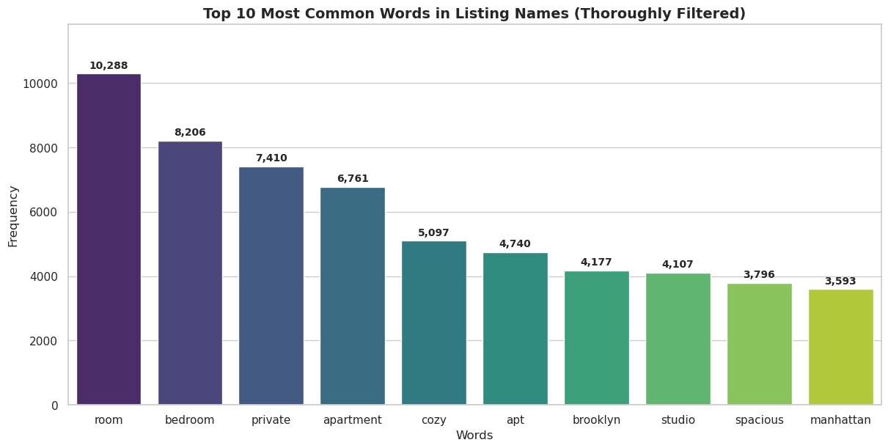
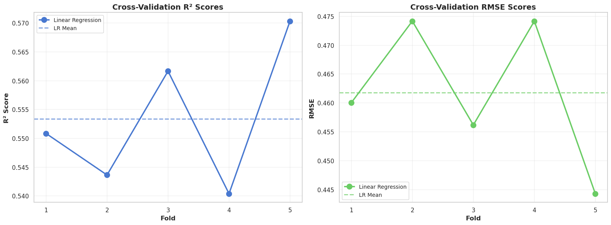
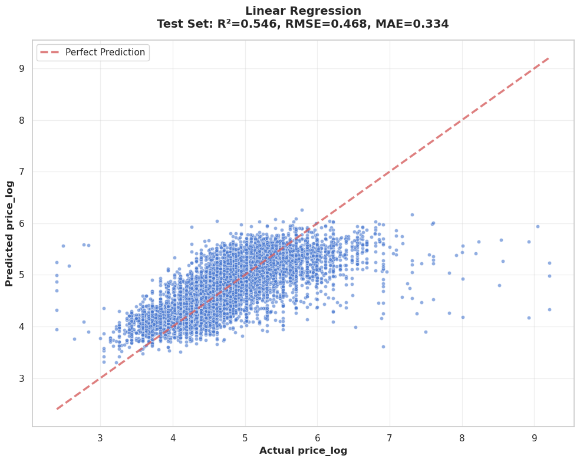
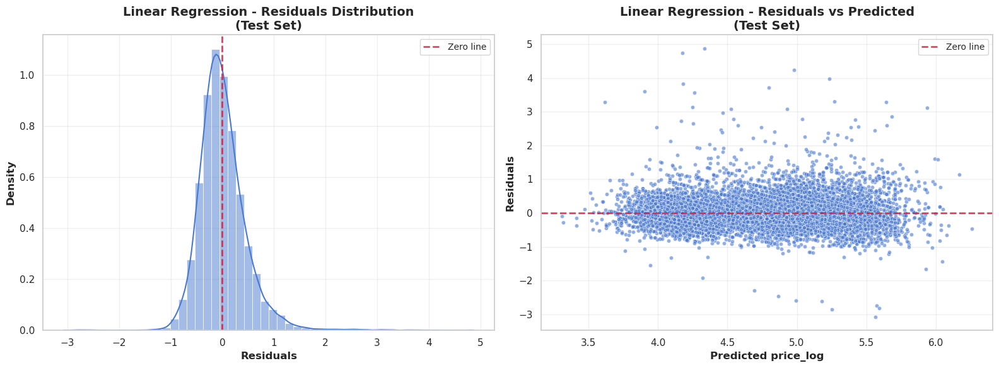
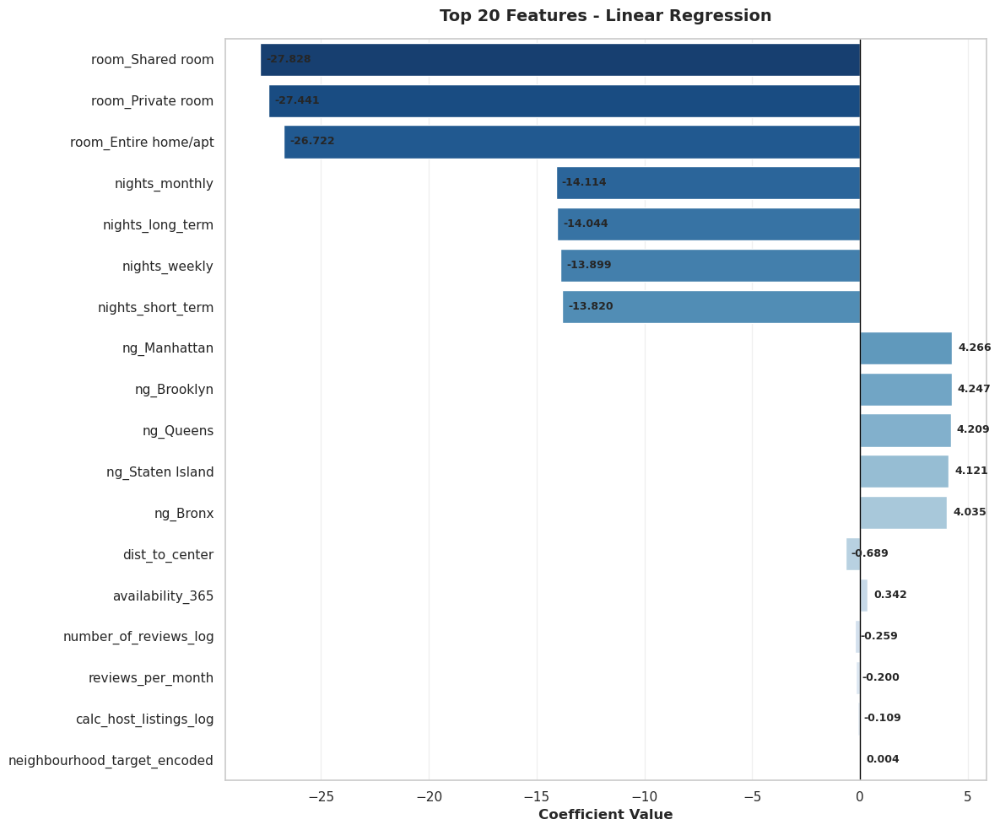

# Airbnb NYC 2019 Price Prediction

Dự án phân tích và dự đoán giá thuê phòng Airbnb tại New York City năm 2019. Điểm đặc biệt của dự án là việc **tự xây dựng (implement from scratch)** các thuật toán Machine Learning cốt lõi (Linear Regression, Lasso Regression) sử dụng thư viện **NumPy**, thay vì phụ thuộc vào các thư viện cấp cao như Scikit-learn.

## 📋 Mục lục
1. [Giới thiệu](#giới-thiệu)
2. [Dataset](#dataset)
3. [Method](#method)
4. [Installation & Setup](#installation--setup)
5. [Usage](#usage)
6. [Results](#results)
7. [Project Structure](#project-structure)
8. [Challenges & Solutions](#challenges--solutions)
9. [Future Improvements](#future-improvements)
10. [Contributors](#contributors)
11. [License](#license)

---

## 🌟 Giới thiệu

### 1. Mô tả bài toán
Dự án tập trung vào việc xây dựng mô hình Machine Learning để dự đoán giá niêm yết (**listing price**) của các căn hộ/phòng Airbnb tại New York City năm 2019.
- **Input:** Các đặc điểm của căn hộ như vị trí (quận, khu vực), loại phòng (nguyên căn, phòng riêng), số đêm tối thiểu, số lượng đánh giá, v.v.
- **Output:** Giá thuê phòng (biến liên tục).
- **Loại bài toán:** Supervised Learning - Regression (Hồi quy tuyến tính).

### 2. Động lực & Ứng dụng thực tế
Việc định giá phòng (Dynamic Pricing) là một thách thức lớn trong nền kinh tế chia sẻ:
- **Đối với Chủ nhà (Hosts):** Giúp họ đưa ra mức giá cạnh tranh để tối đa hóa lợi nhuận và tỷ lệ lấp đầy (occupancy rate), tránh việc định giá quá cao (không ai thuê) hoặc quá thấp (mất doanh thu).
- **Đối với Khách thuê (Guests):** Cung cấp tham chiếu để đánh giá xem một mức giá có hợp lý hay không, giúp họ tìm được các "deal" tốt hoặc tránh bị "hớ".
- **Đối với Nền tảng:** Gợi ý giá tự động giúp cải thiện trải nghiệm người dùng và cân bằng cung cầu thị trường.

### 3. Mục tiêu cụ thể
Dự án không chỉ dừng lại ở việc gọi thư viện có sẵn, mà hướng tới các mục tiêu chuyên sâu:
- **Về Kỹ thuật:** Tự cài đặt (implement from scratch) các thuật toán **Linear Regression** và **Lasso Regression** chỉ sử dụng **NumPy**. Điều này giúp nắm vững bản chất toán học (Matrix Calculus, Gradient Descent, Coordinate Descent).
- **Về Dữ liệu:** Xây dựng quy trình xử lý dữ liệu (Data Pipeline) hoàn chỉnh từ làm sạch, xử lý nhiễu, đến trích xuất đặc trưng (Feature Engineering) nâng cao như Target Encoding.
- **Về Kết quả:** Xây dựng mô hình có độ chính xác chấp nhận được (R² > 0.5) và quan trọng hơn là khả năng **giải thích (interpretability)** - chỉ ra được yếu tố nào tác động mạnh nhất đến giá phòng tại NYC.

---

## 📊 Dataset

### 1. Nguồn dữ liệu
- **Nguồn:** [New York City Airbnb Open Data (Kaggle)](https://www.kaggle.com/dgomonov/new-york-city-airbnb-open-data)
- **Kích thước:** ~49,000 dòng dữ liệu.

### 2. Mô tả các features
- **Categorical:** `neighbourhood_group` (5 quận), `neighbourhood` (200+ khu vực), `room_type` (3 loại).
- **Numerical:** `latitude`, `longitude`, `minimum_nights`, `number_of_reviews`, `reviews_per_month`, `calculated_host_listings_count`, `availability_365`.
- **Target:** `price` (USD).

### 3. Đặc điểm dữ liệu & EDA
Dưới đây là một số biểu đồ quan trọng từ quá trình khám phá dữ liệu:

#### a. Phân phối giá (Price Distribution)
Phần lớn các listing có giá dưới $200/đêm. Biểu đồ bên dưới hiển thị phân phối giá cho các căn hộ <= $500.


#### b. Phân bố địa lý (Geographic Distribution)
Các listing tập trung dày đặc tại Manhattan và Brooklyn. Màu sắc thể hiện mức giá (đỏ/vàng là giá cao).


#### c. Giá theo loại phòng (Price by Room Type)
"Entire home/apt" có mức giá cao nhất và biến động lớn nhất, trong khi "Shared room" có giá thấp nhất.


#### d. Sự thống trị thị trường (Market Domination)
Một số khu vực tại Manhattan bị chi phối mạnh mẽ bởi các "Top Hosts" (những người quản lý nhiều listing), cho thấy tính chất thương mại hóa cao.


#### e. Tương quan biến số (Correlation Matrix)
Biểu đồ nhiệt thể hiện mối tương quan giữa các biến số. Các biến số ít có sự tương quan tuyến tính mạnh với nhau, ngoại trừ `number_of_reviews` và `reviews_per_month`.


#### f. Phân bố mật độ giá theo khu vực (Price Density by Neighbourhood)
Biểu đồ Violin cho thấy mật độ phân phối giá tại Manhattan rộng hơn và có đuôi dài hơn (nhiều listing giá cao) so với các quận khác như Queens hay Bronx.


#### g. Từ khóa phổ biến trong tên listing (Top Words)
Các từ khóa xuất hiện nhiều nhất trong tên phòng thường liên quan đến vị trí ("Manhattan", "Brooklyn", "Williamsburg") và đặc điểm phòng ("Private", "Room", "Cozy", "Spacious").


---

## 🛠 Method

### 1. Quy trình xử lý dữ liệu (Data Preprocessing Pipeline)
Quy trình được thực hiện tuần tự để đảm bảo dữ liệu sạch và giàu thông tin cho mô hình:

#### a. Data Cleaning (Làm sạch)
- **Missing Values:**
  - `reviews_per_month`: NaN được điền bằng 0 (giả định không có review nghĩa là 0 review/tháng).
  - `name`, `host_name`: Các trường văn bản thiếu được điền placeholder hoặc bỏ qua vì không dùng trực tiếp.
- **Outlier Removal:**
  - Loại bỏ các listing có `price = 0` (lỗi dữ liệu).
  - Loại bỏ các listing có giá quá cao (ví dụ > $10,000) để tránh làm lệch mô hình Linear.

#### b. Feature Engineering (Tạo đặc trưng)
- **Log Transformation:**
  - Biến mục tiêu `price` có phân phối lệch phải (right-skewed). Áp dụng `log(1 + price)` để đưa về dạng gần phân phối chuẩn, giúp mô hình hồi quy tuyến tính hoạt động tốt hơn.
- **Geospatial Features:**
  - Tính khoảng cách từ căn hộ đến trung tâm NYC (Times Square) sử dụng công thức **Haversine** dựa trên vĩ độ (`latitude`) và kinh độ (`longitude`).
- **Binning:**
  - Biến `minimum_nights` được chia nhóm thành: `short_term` (<7 ngày), `weekly` (7-30 ngày), `monthly` (>30 ngày) để bắt được các hành vi thuê khác nhau.

#### c. Encoding (Mã hóa biến phân loại)
- **One-Hot Encoding:** Áp dụng cho biến có ít giá trị (`neighbourhood_group`, `room_type`).
- **Target Encoding (with Smoothing):**
  - Áp dụng cho biến `neighbourhood` (hơn 200 giá trị). Thay vì tạo 200 cột mới (gây thưa dữ liệu), ta thay thế tên khu vực bằng giá trung bình của khu vực đó.
  - **Smoothing:** Để tránh overfitting với các khu vực có ít dữ liệu, công thức được điều chỉnh:
    $$ S_i = \lambda \times \mu_i + (1 - \lambda) \times \mu_{global} $$
    Trong đó $\mu_i$ là giá trung bình khu vực $i$, $\mu_{global}$ là giá trung bình toàn tập dữ liệu.

#### d. Scaling (Chuẩn hóa)
- Sử dụng **Min-Max Scaling** để đưa tất cả các biến số về khoảng $[0, 1]$. Điều này đặc biệt quan trọng với Lasso Regression vì thuật toán này nhạy cảm với độ lớn của dữ liệu (scale-sensitive).

### 2. Thuật toán & Cài đặt (Algorithms & Implementation)

Dự án tự cài đặt các class `LinearRegression` và `Lasso` kế thừa cấu trúc tương tự Scikit-learn (`fit`, `predict`).

#### a. Linear Regression (Hồi quy tuyến tính)
**Mục tiêu:** Tìm vector trọng số $\beta$ sao cho tổng bình phương sai số (RSS) là nhỏ nhất:
$$ J(\beta) = ||y - X\beta||_2^2 = \sum_{i=1}^{n} (y_i - x_i^T\beta)^2 $$

**Giải pháp (Closed-form Solution):**
Nghiệm tối ưu được tính bằng phương trình chuẩn (Normal Equation):
$$ \hat{\beta} = (X^T X)^{-1} X^T y $$

**Implementation với NumPy:**
Thay vì tính nghịch đảo ma trận $(X^T X)^{-1}$ (tốn kém và kém ổn định), ta giải hệ phương trình tuyến tính $A\beta = b$:
- Đặt $A = X^T X$ và $b = X^T y$.
- Sử dụng hàm tối ưu của NumPy:
  ```python
  # self.weights = np.linalg.inv(X.T @ X) @ X.T @ y  <-- Không nên dùng
  self.weights = np.linalg.solve(X.T @ X, X.T @ y) # <-- Tối ưu hơn
  ```

#### b. Lasso Regression (L1 Regularization)
**Mục tiêu:** Tối thiểu hóa hàm mất mát có thêm thành phần điều chuẩn L1 (giúp triệt tiêu các trọng số không quan trọng về 0):
$$ J(\beta) = \frac{1}{2n} ||y - X\beta||_2^2 + \alpha ||\beta||_1 $$

**Giải pháp (Coordinate Descent):**
Vì hàm L1 không có đạo hàm tại 0, ta không dùng Gradient Descent thông thường mà dùng **Coordinate Descent**. Ta tối ưu từng trọng số $\beta_j$ trong khi giữ cố định các trọng số $\beta_{k \neq j}$.

Công thức cập nhật cho $\beta_j$:
$$ \beta_j = S(\rho_j, \alpha) $$
Trong đó:
- $\rho_j = \sum_{i=1}^{n} x_{ij} (y_i - \sum_{k \neq j} x_{ik}\beta_k)$ (tương quan giữa biến $j$ và phần dư).
- $S(z, \alpha)$ là toán tử **Soft Thresholding**:
  $$ S(z, \alpha) = \begin{cases} z - \alpha & \text{nếu } z > \alpha \\ z + \alpha & \text{nếu } z < -\alpha \\ 0 & \text{nếu } |z| \le \alpha \end{cases} $$

**Implementation với NumPy:**
- Tính toán trước các giá trị không đổi để tăng tốc vòng lặp.
- Sử dụng vectorization để tính dự đoán $\hat{y}$ và phần dư $r = y - \hat{y}$.
- Cập nhật trọng số lặp đi lặp lại cho đến khi hội tụ (sai số thay đổi nhỏ hơn ngưỡng `tol`).

---

## ⚙️ Installation & Setup

### Yêu cầu hệ thống
- Python 3.8+
- Thư viện: NumPy, Matplotlib, Seaborn (xem `requirements.txt`)

### Cài đặt môi trường
```bash
pip install -r requirements.txt
```

---

## 🚀 Usage

### Hướng dẫn cách chạy từng phần
1.  **Khám phá dữ liệu (EDA):**
    - Mở và chạy `notebooks/01_data_exploration.ipynb` để xem phân tích phân phối, bản đồ và tương quan.
2.  **Tiền xử lý dữ liệu (Preprocessing):**
    - Chạy `notebooks/02_preprocessing.ipynb` để thực hiện làm sạch, mã hóa và chuẩn hóa dữ liệu. Kết quả sẽ được lưu vào `data/processed/`.
3.  **Huấn luyện & Đánh giá (Modeling):**
    - Chạy `notebooks/03_modeling.ipynb` để huấn luyện mô hình Linear/Lasso và xem kết quả chi tiết.

---

## 📈 Results

### 1. Kết quả đạt được (Metrics)
Kết quả đánh giá trên tập Test (20% dữ liệu) sau khi tối ưu hóa tham số:

| Metric | Train Set | Test Set | Cross-Validation (Mean) | Ý nghĩa |
|--------|-----------|----------|-------------------------|---------|
| **R² Score** | **0.554** | **0.546** | 0.553 (±0.011) | Mô hình giải thích được ~54.6% sự biến thiên của giá. |
| **RMSE** | 0.462 | 0.468 | 0.462 (±0.011) | Sai số trung bình (trên thang log). |
| **MAE** | 0.335 | 0.334 | 0.335 (±0.005) | Sai số tuyệt đối trung bình. |

> **Nhận xét:** Chỉ số R² giữa tập Train và Test chênh lệch rất nhỏ (0.008), cho thấy mô hình **không bị Overfitting** và có khả năng tổng quát hóa tốt.

### 2. Trực quan hóa kết quả (Visualizations)

#### a. Cross-Validation Scores
Biểu đồ cho thấy sự ổn định của mô hình qua 5 lần chia dữ liệu (5-fold CV).


#### b. Actual vs Predicted
Biểu đồ phân tán giữa giá thực tế và giá dự đoán. Các điểm tập trung quanh đường chéo đỏ ($y=x$) cho thấy độ chính xác khá tốt, tuy nhiên mô hình có xu hướng dự đoán thấp hơn thực tế ở phân khúc giá rất cao (luxury).


#### c. Residuals Analysis
Phân phối của phần dư (Residuals) gần chuẩn (Normal distribution) và tập trung quanh 0, cho thấy mô hình không bị bias lớn.


#### d. Feature Importance
Các yếu tố ảnh hưởng mạnh nhất đến giá phòng.
- **Tăng giá:** Entire home/apt, Manhattan, các khu vực đắt đỏ.
- **Giảm giá:** Shared room, Bronx, các khu vực xa trung tâm.


### 3. So sánh và phân tích

#### Phân tích các yếu tố ảnh hưởng (Feature Importance)
Dựa trên trọng số ($\beta$) của mô hình, ta rút ra các insight quan trọng:

1.  **Vị trí là quan trọng nhất:**
    - `neighbourhood_group_Manhattan` có hệ số dương lớn nhất (+4.266), khẳng định Manhattan là khu vực đắt đỏ nhất.
    - `dist_to_center` có hệ số âm (-0.689), nghĩa là càng xa trung tâm, giá càng giảm.
2.  **Loại phòng quyết định mức giá sàn:**
    - Các biến `room_type` (Shared room, Private room) có hệ số âm rất lớn so với `Entire home/apt` (được ẩn trong intercept hoặc so sánh tương đối), cho thấy thuê nguyên căn đắt hơn nhiều so với thuê phòng lẻ.
3.  **Tính khả dụng:**
    - `availability_365` có hệ số dương (+0.342), gợi ý rằng các căn hộ chuyên nghiệp (trống quanh năm để cho thuê) thường có giá cao hơn các căn hộ chỉ cho thuê ngắn hạn/thời vụ.

#### So sánh Linear Regression vs Lasso
- **Hiệu năng:** Hai mô hình cho kết quả tương đương nhau (R² ~ 0.55).
- **Lựa chọn:**
    - **Linear Regression** được chọn làm mô hình cuối cùng vì tính đơn giản và không cần tinh chỉnh tham số $\alpha$ phức tạp mà vẫn đạt hiệu quả cao.
    - **Lasso** hữu ích trong việc xác định các đặc trưng thừa (đưa hệ số về 0), nhưng trong tập dữ liệu này, hầu hết các đặc trưng đã chọn lọc đều có ý nghĩa thống kê.

---

## 📂 Project Structure

```
├── data/
│   ├── raw/                # Dữ liệu thô (AB_NYC_2019.csv)
│   └── processed/          # Dữ liệu đã qua xử lý (train/test features)
├── notebooks/
│   ├── 01_data_exploration.ipynb  # EDA: Phân tích phân phối, bản đồ, tương quan
│   ├── 02_preprocessing.ipynb     # Pipeline: Cleaning, Encoding, Scaling
│   └── 03_modeling.ipynb          # Modeling: Linear/Lasso from scratch, CV, Evaluation
├── src/
│   ├── data_processing.py  # Các hàm tiện ích xử lý dữ liệu
│   ├── models.py           # Cài đặt class LinearRegression, Lasso, KFold
│   └── visualization.py    # Các hàm vẽ biểu đồ
├── README.md               # Tài liệu báo cáo dự án
└── requirements.txt        # Danh sách thư viện phụ thuộc
```

---

## 🧩 Challenges & Solutions

### 1. Vectorization với NumPy
- **Khó khăn:** Chuyển đổi các công thức toán học (như Coordinate Descent) từ dạng vòng lặp (for-loop) sang dạng vector hóa để tăng tốc độ tính toán trên tập dữ liệu lớn. Việc dùng vòng lặp trong Python rất chậm.
- **Giải pháp:**
  - Tận dụng triệt để **Broadcasting** của NumPy để thực hiện phép tính trên toàn bộ mảng mà không cần loop.
  - Sử dụng các phép toán ma trận tối ưu (`@` cho nhân ma trận, `np.sum`, `np.where`).
  - Pre-compute (tính trước) các giá trị không đổi (như $X^T X$ hoặc $||x_j||^2$) bên ngoài vòng lặp tối ưu.

### 2. Xử lý biến phân loại nhiều giá trị (High Cardinality)
- **Khó khăn:** Cột `neighbourhood` có hơn 200 giá trị khác nhau. Nếu sử dụng One-Hot Encoding thông thường sẽ tạo ra hơn 200 cột mới, làm ma trận đặc trưng trở nên rất thưa (sparse) và tăng chi phí tính toán, đồng thời dễ gây overfitting.
- **Giải pháp:** Áp dụng **Target Encoding** kết hợp **Smoothing**. Thay vì tạo cột mới, ta thay thế giá trị của `neighbourhood` bằng giá trung bình của mục tiêu (`price`) tại khu vực đó, có điều chỉnh (smoothing) để tránh nhiễu ở các khu vực ít dữ liệu.

### 3. Ổn định số học (Numerical Stability)
- **Khó khăn:** Khi tính toán nghịch đảo ma trận $(X^T X)^{-1}$ trong Linear Regression, nếu ma trận $X^T X$ gần suy biến (singular) hoặc có điều kiện số (condition number) lớn, kết quả sẽ rất thiếu chính xác.
- **Giải pháp:** Thay vì tính nghịch đảo trực tiếp bằng `np.linalg.inv`, sử dụng `np.linalg.solve` để giải hệ phương trình tuyến tính, giúp thuật toán ổn định và chính xác hơn.

---

## 🔮 Future Improvements

1.  **Mở rộng mô hình:**
    - Thử nghiệm các mô hình phi tuyến tính (Non-linear) như **Decision Tree**, **Random Forest** hoặc **Gradient Boosting** (tự cài đặt) để bắt được các mối quan hệ phức tạp hơn mà mô hình tuyến tính bỏ qua.
    - Cài đặt thêm **Ridge Regression** (L2 Regularization) và **Elastic Net** (kết hợp L1 & L2).

2.  **Cải thiện dữ liệu:**
    - Tích hợp thêm dữ liệu bên ngoài (External Data) như: khoảng cách đến trạm tàu điện ngầm gần nhất, chỉ số an ninh khu vực, hoặc khoảng cách đến các điểm du lịch nổi tiếng khác ngoài Times Square.
    - Sử dụng NLP để phân tích nội dung review hoặc tên listing (`name`) để trích xuất thêm đặc trưng (ví dụ: "luxury", "cozy", "view").

3.  **Ứng dụng:**
    - Xây dựng một Web App đơn giản (sử dụng Streamlit hoặc Flask) cho phép người dùng nhập thông tin căn hộ và nhận dự đoán giá ngay lập tức.
    - Triển khai API để tích hợp vào các hệ thống khác.

---

## 👥 Contributors

**Shinoaki0145**
- **Role:** Data Scientist & ML Engineer
- **Github:** [Shinoaki0145](https://github.com/Shinoaki0145)

---

## 📜 License
This project is licensed under the MIT License - see the LICENSE file for details.
